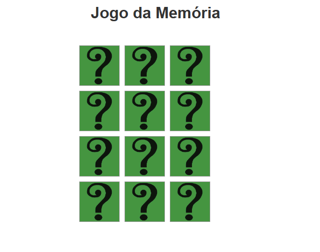

# Jogo da Memória

Este é um jogo da memória desenvolvido em HTML, CSS e JavaScript. O objetivo do jogo é encontrar todos os pares de cartas correspondentes no menor número de tentativas possível.

## Como jogar

1. Abra o arquivo `index.html` em um navegador web.
2. Ao iniciar o jogo, será exibida uma caixa de diálogo solicitando o nível de dificuldade. Digite "easy", "medium" ou "hard" e pressione Enter.
3. As cartas serão embaralhadas e dispostas no tabuleiro.
4. Clique em duas cartas para virá-las.
5. Se as cartas forem correspondentes, elas permanecerão viradas. Caso contrário, elas serão viradas de volta após 1 segundo.
6. Continue virando as cartas e encontrando os pares correspondentes até que todas as cartas estejam viradas.
7. Ao concluir o jogo, uma caixa de diálogo será exibida com o número de tentativas realizadas.

## Personalização

Você pode personalizar o jogo adicionando suas próprias imagens ou ajustando o estilo do jogo. Para isso, siga as instruções abaixo:

### Adicionar imagens

1. Substitua as imagens existentes na pasta `img` por suas próprias imagens.
2. Garanta que as imagens tenham a mesma extensão (por exemplo: `.jpg`, `.png`, `.gif`) e que estejam nomeadas corretamente no formato `img1`, `img2`, `img3`, etc.

### Ajustar o estilo

- Para alterar as cores, fontes ou outros estilos, edite o arquivo `style.css`.
- Você pode modificar as classes existentes ou adicionar novas classes para personalizar o visual do jogo.

## Contribuição

Contribuições são bem-vindas! Sinta-se à vontade para enviar pull requests com melhorias no código, correções de bugs ou adição de novos recursos.
